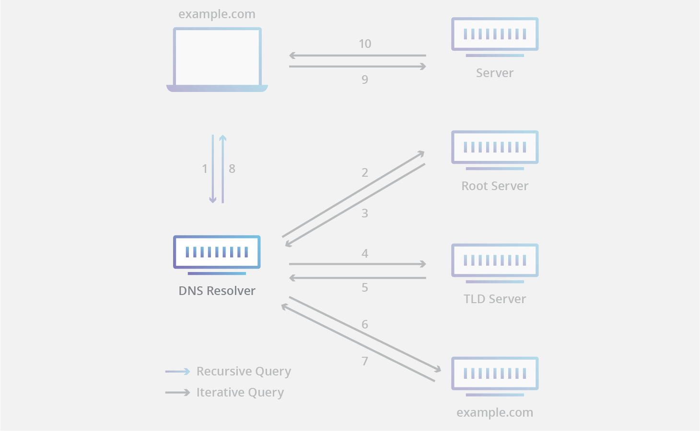

# DNS
ref: [DNS server types | Cloudflare](https://www.cloudflare.com/learning/dns/dns-server-types/)

- Recursive resolver
- Root nameserver
- TLD nameserver
- Authoritative nameserver

1. Client sends a DNS query to DNS Resolver.
2. DNS Resolver resopnds with cached data, or sends a request to a root nameserver.
3. Root nameserver responds.
4. DNS Resolver sends another request to TLD nameserver.
5. TLD nameserver responds.
6. DNS Resolver sends last request to authoritative nameserver.
7. Authoritative nameserver responds.
8. DNS Resolver renponds with IP address to client.

## Recursive resolver
also known as DNS Resolver.

acts as a middleman between a client and a DNS nameserver.

## Root nameserver
overseen by Internet Corporartion for Assigned Names and Numbers (ICANN).

13 root nameserver are known to every recursive resolver.

while there are 13 root nameservers, there are 600 different servers including all the instances of root nameservers..

## TDL nameserver
managed by Internet Assigned Numbers Authority (IANA), which is a branch of ICANN.

- Country code top-level doamins
  - specific to a country or state.
  - ex: `.uk`, `.us`, `.ru`, `.jp`
- Generic top-level domains
  - ex: `.com`, `.org`, `.net`, `.edu`, `.gov`

### Authoritative nameserver
responds with IP address found in the DNS A record.

responds with an alias domain if the domain has a CNAME record.
